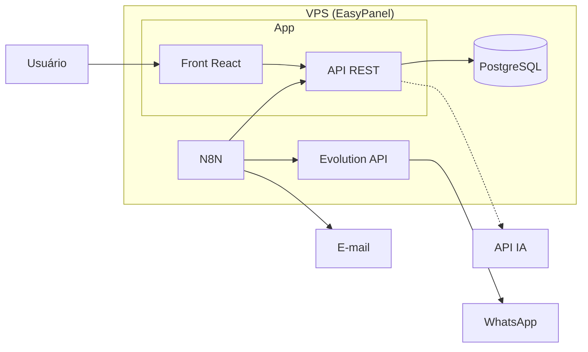

# Plano: Escopo, Regras de Negócio, Tecnologias e MVP  
## Sistema de Agenda e Controle de Prazos — Escritório de Advocacia

**Objetivo:** Substituir o sistema legado por uma solução moderna, segura e **o mais automatizada possível**, reduzindo inserção manual de prazos e tempo operacional.  
**Entrega inicial:** MVP bem definido, depois evolução contínua.

---

## 1. Visão e Objetivos

| Objetivo | Descrição |
|----------|-----------|
| **Menos trabalho manual** | Hoje os prazos são inseridos manualmente; processo arcaico e demorado. Automatizar captura, lembretes e fluxos onde for viável. |
| **Stack moderna e escalável** | VPS + EasyPanel + GitHub; PostgreSQL; API própria; integrações (WhatsApp, N8N, IA). |
| **Comunicação proativa** | WhatsApp (Evolution API) e e-mail para alertas de prazos e audiências. |
| **Inteligência onde fizer sentido** | IA para extrair ou sugerir prazos de documentos (petições, decisões), reduzindo digitação. |
| **Orquestração** | N8N para workflows (webhooks, agendamentos, notificações, integrações). |
| **MVP apresentável** | Escopo fechado de MVP para validar com o cliente antes de expandir. |

---

## 2. Stack Tecnológica Recomendada

### 2.1 Infraestrutura e Deploy

| Componente | Escolha | Papel |
|------------|---------|--------|
| **VPS** | Qualquer provedor (Hetzner, DigitalOcean, Contabo, etc.) | Hospedar todos os serviços. |
| **EasyPanel** | Deploy e orquestração de containers | Subir app, PostgreSQL, N8N, Evolution API, etc., com painel e domínios. |
| **GitHub** | Repositório do código | CI (opcional), versionamento, colaboração. |
| **Docker** | Imagens e docker-compose | Aplicação e dependências containerizadas para EasyPanel. |

### 2.2 Backend e Dados

| Componente | Escolha | Papel |
|------------|---------|--------|
| **API** | Node.js (Express/Fastify) ou outro (ex.: Python FastAPI) | REST/API única para o front e para N8N/Evolution/IA. |
| **Banco de dados** | **PostgreSQL** | Dados principais (usuários, prazos, audiências, agenda, processos, logs). |
| **ORM / Migrations** | Drizzle ou Prisma (Node) / SQLAlchemy+Alembic (Python) | Schema versionado, migrations, tipo-seguro. |

### 2.3 Frontend

| Componente | Escolha | Papel |
|------------|---------|--------|
| **App web** | React (Vite) ou Next.js | Dashboard, cadastros, calendário, listagens. |
| **UI** | Tailwind + componentes (shadcn/ui ou similar) | Interface moderna e consistente. |
| **Estado / Servidor** | TanStack Query + chamadas à API | Cache, refetch, UX fluida. |

### 2.4 Integrações e Automação

| Componente | Escolha | Papel |
|------------|---------|--------|
| **WhatsApp** | **Evolution API** | Envio e (opcional) recebimento de mensagens; alertas de prazos/audiências. |
| **Workflows** | **N8N** | Agendar lembretes, webhooks da API, processar documentos, chamar IA, enviar WhatsApp/e-mail. |
| **E-mail** | SMTP (Resend, SendGrid ou servidor do escritório) | Notificações e relatórios; config via env. |
| **IA** | API (OpenAI, Claude, ou modelo local) | Extrair/sugerir prazos e dados de petições/decisões; possível uso via N8N ou direto na API. |

### 2.5 IA e MCP

| Componente | Papel |
|------------|--------|
| **IA (LLM)** | Análise de texto de documentos jurídicos para sugerir tipo de prazo, data, partes; pré-preencher formulário ou criar rascunho de prazo. |
| **MCP (Model Context Protocol)** | Uso no **desenvolvimento** (ex.: Cursor) para ferramentas e contexto; não obrigatório na aplicação em produção. Se no futuro houver “assistente interno” na aplicação, pode-se avaliar servidor MCP próprio. |

### 2.6 Resumo da Stack (uma linha)

**VPS → EasyPanel (Docker) → GitHub | PostgreSQL | API (Node ou Python) | Front React (Vite) | Evolution API (WhatsApp) | N8N (workflows) | IA para extração de prazos.**

---

## 3. Escopo

### 3.1 Dentro do escopo (MVP + evolução)

- Controle de **prazos** (tipos: administrativo, cível, trabalhista; múltiplos advogados; status cumprido/não cumprido).
- **Audiências** (processo, vara, local, partes, data/hora, vínculo com usuários).
- **Agenda de contatos** (escritório).
- **Usuários** e **grupos/permissões** (admin vs usuário).
- **Dashboard** (hoje, semana, calendário).
- **Notificações** por WhatsApp e e-mail (lembretes de prazos e audiências).
- **API** estável para o front e para N8N/Evolution.
- **Automação:** cadastro/sugestão de prazos a partir de documentos (IA) e/ou integrações (N8N).
- **Relatórios** básicos (prazos por período, por advogado, audiências).
- Migração dos **dados atuais** (MySQL → PostgreSQL).

### 3.2 Fora do escopo (explicitamente)

- Sistema processual completo (PJe, Projudi, etc.); apenas **controle** de prazos e audiências.
- Gestão financeira ou de honorários (outro módulo/projeto).
- App mobile nativo no MVP (pode vir depois; web responsiva entra no escopo).

### 3.3 MVP vs Fase 2 (resumo)

- **MVP:** foco em paridade funcional melhorada + segurança + notificações (WhatsApp + e-mail) + API + deploy (VPS/EasyPanel). Opcional no MVP: primeiro fluxo de IA (sugestão de prazo a partir de texto).
- **Fase 2:** IA mais presente (extração de prazos em lote), mais workflows N8N, relatórios avançados, integrações adicionais (ex.: calendário externo), melhorias de UX.

---

## 4. Regras de Negócio

### 4.1 Usuários e Acesso

- **Admin:** pode criar/editar/excluir usuários, prazos, audiências, agenda e acessar relatórios.
- **Usuário (advogado):** pode ver e editar apenas o que está vinculado a ele (seus prazos e audiências); pode ver agenda; não acessa gestão de usuários nem relatórios administrativos.
- Autenticação: login/senha (hash seguro, ex.: bcrypt); sessão ou JWT conforme implementação da API.
- Credenciais e chaves (banco, SMTP, Evolution API, N8N, IA) em **variáveis de ambiente**; nunca no código.

### 4.2 Prazos

- **Tipos:** Administrativo, Cível, Trabalhista (lista configurável no futuro).
- **Data do prazo:** obrigatória; apenas dias úteis (segunda a sexta) se a regra do escritório for essa.
- **Responsáveis:** um prazo pode ter um ou mais advogados (N:N).
- **Status:** Não cumprido | Cumprido (com indicação de quem cumpriu e data/hora).
- **Conteúdo e observação:** texto livre; no futuro a IA pode sugerir com base em documento.
- **Regra de lembrete:** enviar alertas por WhatsApp e e-mail em dias configuráveis (ex.: D-3, D-1, D-day) para responsáveis ativos.

### 4.3 Audiências

- **Dados obrigatórios:** número do processo, vara, local, data e hora, ao menos um participante (reclamante/reclamado/preposto conforme uso).
- **Responsáveis:** uma audiência pode ter um ou mais advogados (N:N).
- **Lembretes:** notificação em dias configuráveis (ex.: D-1, D-day).

### 4.4 Agenda (Contatos)

- **Campos:** nome, telefone, celular, e-mail, endereço, nascimento (opcional).
- Apenas admin (ou perfil com permissão) pode criar/editar/excluir; demais podem visualizar/buscar.

### 4.5 Notificações

- **Canal:** WhatsApp (Evolution API) e e-mail (SMTP).
- **Gatilhos:** prazos e audiências conforme regras de antecedência (configurável).
- **Destinatários:** advogados vinculados ao prazo/audiência; usuário pode ter opção de desativar notificações por canal (ex.: só e-mail, ou só WhatsApp).

### 4.6 Automação (N8N + API)

- **Webhooks:** a API expõe endpoints para N8N (ex.: “novo prazo”, “prazo cumprido”) para disparar workflows.
- **Agendamento:** N8N em cron (ex.: todo dia 8h) consulta API ou banco para “prazos/audiências que vencem em X dias” e dispara envio (Evolution API + e-mail).
- **Documentos:** fluxo (N8N ou API) recebe texto ou arquivo → IA extrai/sugere prazos → API cria rascunho ou prazo sugerido para o usuário confirmar.

### 4.7 Auditoria e Histórico (recomendado)

- **created_at, updated_at** em tabelas principais.
- **created_by, updated_by** quando fizer sentido (quem criou/alterou o prazo ou audiência).
- Opcional: tabela de log de alterações para prazos críticos.

---

## 5. Funcionalidades: MVP vs Roadmap

### 5.1 MVP (obrigatório para apresentação)

| # | Funcionalidade | Descrição |
|---|----------------|-----------|
| 1 | **Login e perfis** | Login seguro (bcrypt), sessão/JWT; telas por perfil (admin vs usuário). |
| 2 | **Dashboard** | Resumo do dia e da semana (prazos, audiências); calendário mensal/anual com indicadores (vencido, hoje, futuro, cumprido). |
| 3 | **CRUD Prazos** | Criar, editar, listar, filtrar por data/tipo/status; múltiplos responsáveis; marcar como cumprido. |
| 4 | **CRUD Audiências** | Criar, editar, listar; vínculo com usuários; dados processuais. |
| 5 | **Agenda de contatos** | Listar, buscar, criar/editar (conforme permissão). |
| 6 | **CRUD Usuários (admin)** | Cadastro de usuários, grupo (admin/usuário), ativo/inativo. |
| 7 | **API REST** | Endpoints para front e para N8N (listar prazos/audiências por data, criar prazo, etc.). |
| 8 | **Notificações** | Lembretes por **e-mail** (e se possível **WhatsApp** no MVP) em D-1 e D-day para prazos e audiências, via N8N ou job na API. |
| 9 | **Deploy** | App + PostgreSQL + (opcional) N8N e Evolution API na VPS com EasyPanel; repositório no GitHub. |
| 10 | **Migração de dados** | Script ou fluxo para migrar dados do MySQL (agenda_agendacv) para PostgreSQL. |

### 5.2 MVP opcional (se der tempo)

- **Primeiro fluxo com IA:** endpoint ou tela “Enviar texto” → IA sugere tipo, data e resumo de prazo → usuário confirma e salva.
- **N8N:** um workflow “diário” que chama a API, monta lista de prazos/audiências do dia e envia e-mail e WhatsApp.

### 5.3 Fase 2 (pós-MVP)

- Extração de prazos em lote (upload de PDF/texto → IA → sugestões em tabela para aprovar).
- Mais antecedências de lembrete (D-5, D-3, D-1, D-day) configuráveis por tipo de prazo.
- Relatórios avançados (por advogado, por tipo, taxa de cumprimento).
- Integração com calendário (Google Calendar / Outlook).
- Configuração de “horário de envio” e preferências de notificação por usuário.
- Possível “assistente” na aplicação (chat ou tela de sugestões usando IA/MCP conforme evolução do produto).

---

## 6. Automação: Onde Cada Peça Entra

> **De onde podem vir os prazos (além do manual)?**  
> Não existe “API da OAB” com prazos. O que existe: **(1)** API pública do **CNJ (Datajud)** com movimentações processuais → dá para derivar/sugerir prazos por regra ou IA; **(2)** APIs comerciais (ex.: **Jusbrasil**) para listar processos por OAB e receber intimações por webhook → criar prazos a partir das intimações. Raspagem de sites de tribunais não é recomendada. Detalhes em **`FONTES_DADOS_JURIDICOS_AUTOMATIZACAO_PRAZOS.md`**.

### 6.1 Problema atual

- Prazos inseridos **totalmente manualmente**.
- Processo lento e repetitivo; risco de esquecimento e atraso.

### 6.2 Visão da automação

| Etapa | Quem faz | Como |
|-------|----------|------|
| **Entrada de dados** | Usuário ou IA | Formulário manual **ou** envio de texto/PDF → IA sugere prazos → usuário confirma. |
| **Armazenamento** | API + PostgreSQL | API recebe criação/edição; N8N pode criar via API (ex.: integração com e-mail do tribunal, futuramente). |
| **Lembretes** | N8N + Evolution API + SMTP | N8N (cron diário) consulta API ou DB → para cada prazo/audiência dentro da janela (D-3, D-1, D-day) → envia WhatsApp (Evolution) e e-mail. |
| **Marcar cumprido** | Usuário na aplicação | Botão “Cumprido” na tela; opcional: marcar via resposta no WhatsApp (N8N + webhook Evolution → API). |

### 6.3 Fluxos N8N sugeridos (MVP / Fase 2)

1. **Diário de lembretes**  
   Schedule (ex.: 8h) → HTTP Request (API: “prazos/audiências que vencem em 1 e 0 dias”) → para cada item → Evolution API (WhatsApp) + Send Email.

2. **Webhook “novo prazo”**  
   API ao criar prazo chama N8N (webhook) → N8N envia confirmação por WhatsApp aos responsáveis (opcional no MVP).

3. **Processar texto e sugerir prazo (Fase 2)**  
   Webhook recebe texto → chama serviço de IA → parseia resposta → chama API para criar “rascunho” ou sugestão → notifica usuário.

### 6.4 Evolution API (WhatsApp)

- Instância dedicada ao escritório (ou número específico).
- Envio de mensagens via API (chamada pela nossa API ou por N8N).
- Opcional: receber confirmação “Cumprido” por resposta e atualizar via API (N8N + webhook).

### 6.5 IA

- **MVP (opcional):** um endpoint “sugerir prazo” que recebe texto (petição, decisão, etc.) e devolve tipo sugerido, data sugerida, resumo.
- **Fase 2:** fluxo em lote (vários documentos) e pré-preenchimento de formulário na tela.

---

## 7. Infraestrutura (VPS + EasyPanel + GitHub)

### 7.1 VPS

- 1 servidor (2 vCPU, 4 GB RAM como ponto de partida; ajustar conforme PostgreSQL + app + N8N + Evolution).
- SO: Ubuntu 22.04 LTS (ou outro suportado pelo EasyPanel).
- Firewall: apenas portas 80/443 e SSH; serviços internos (PostgreSQL, N8N, Evolution) não expostos diretamente.

### 7.2 EasyPanel

- Deploy via **templates** ou **docker-compose**: App (API + front ou só API se front for estático), PostgreSQL, N8N, Evolution API.
- Variáveis de ambiente gerenciadas no painel (DB URL, JWT_SECRET, Evolution API URL, chaves de IA, etc.).
- Domínio e SSL (Let’s Encrypt) configurados no EasyPanel.

### 7.3 GitHub

- Repositório único (ou monorepo: `api`, `web`, `docs`, `scripts/migracao`).
- Branch `main` para produção; `develop` ou feature branches para desenvolvimento.
- `.env` e secrets nunca versionados; uso de GitHub Secrets se houver CI (build/deploy).

### 7.4 Serviços no mesmo VPS (sugestão)

| Serviço | Porta interna | Observação |
|--------|----------------|------------|
| API + Front (ou só API) | 3000 / 80 | Servido pelo EasyPanel/reverse proxy. |
| PostgreSQL | 5432 | Acesso apenas na rede interna. |
| N8N | 5678 | Painel interno ou subdomínio restrito. |
| Evolution API | 8080 | Uso apenas pela API e N8N. |

---

## 8. Definição do MVP (checklist para apresentação)

Antes de considerar o MVP “definido” para apresentar ao cliente:

- [ ] **Escopo** fechado em documento (este plano).
- [ ] **Regras de negócio** validadas com o cliente (perfis, tipos de prazo, lembretes).
- [ ] **Stack** aprovada: VPS, EasyPanel, GitHub, PostgreSQL, API, React, Evolution API, N8N.
- [ ] **Funcionalidades MVP** listadas e priorizadas (paridade + notificações + API + deploy).
- [ ] **Automação** descrita: quem insere o quê; como funcionam os lembretes (e-mail + WhatsApp); papel da IA no MVP (opcional).
- [ ] **Migração** de dados (MySQL → PostgreSQL) planejada e no escopo.
- [ ] **Cronograma** estimado (semanas) para desenvolvimento do MVP.

---

## 9. Próximos passos sugeridos

1. **Validar com o cliente** este plano (escopo, regras, MVP).
2. **Detalhar modelo de dados** em PostgreSQL (entidades, índices, auditoria) e escrever migrations.
3. **Definir contrato da API** (endpoints, payloads) para o front e para N8N.
4. **Montar repositório** no GitHub (estrutura de pastas: api, web, docs, scripts).
5. **Implementar MVP** na ordem: API + banco → front (dashboard, prazos, audiências, agenda, usuários) → notificações (N8N + Evolution + e-mail) → migração de dados → deploy EasyPanel.
6. **Apresentar MVP** e, a partir do feedback, planejar Fase 2 (IA, mais automação, relatórios).

---

---

## 10. Visão da arquitetura (referência)

---

*Documento de planejamento — Sistema Agenda e Prazos. Alinhado à avaliação do sistema atual e à stack VPS, GitHub, EasyPanel, PostgreSQL, Evolution API, N8N e IA.*
